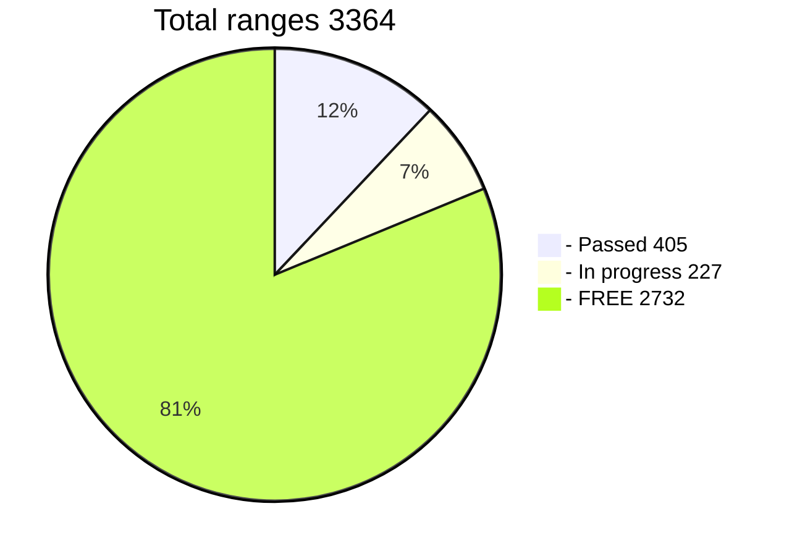

# Challenge WIF 500
</br>
**Find the key, get 200 BTC**</br>

The known part of the key is 40 characters from 52</br>
The address [1PfNh5fRcE9JKDmicD2Rh3pexGwce1LqyU](https://www.blockchain.com/btc/address/1PfNh5fRcE9JKDmicD2Rh3pexGwce1LqyU)</br>

### Challenge is a collective search for a key
A large range of 12 characters is divided into 3364 small ranges.</br>
The program is configured correctly, it takes into account many technical aspects of searching for the initial part of the key.</br>
There is a [**table of hunters**](https://github.com/phrutis/wif500/blob/main/x64/Release/table.md) on which ranges are indicated in the process and passed.</br>
This way you won't serch empty ranges. This speeds up the overall search process.</br>
The advantage of the challenge is that if the key is found, each hunter will receive compensation for the ranges he has passed.</br>
200 btc is a worthy reward for a find key.</br>
Good luck!</br>

## How to participate in the challenge:
If you have a GPUs:</br>
**RTX 2070, 2080, 2090, 3060, 3070, 3080, 3090, A5000, A6000** and are ready to search for a key **24/7**</br>

If you do not have a 30xx card, you can [**rent**](https://vast.ai) it and participate in a collective search. </br>
For some users, [**renting**](https://vast.ai) is cheaper than searching on their own PC. There is also less noise in the house.</br>
When renting, you must take into account the risk that the key may not be found at all.</br> 
You may incur losses. Think of it not as earnings, but as a lottery.

In the [**TABLE**](https://github.com/phrutis/wif500/blob/main/x64/Release/table.md), select a **FREE** range between 0-3363

Run ```wif500-30xx.exe -range 1234``` (free range 0 - 3363)

RTX A6000 4 Gkey/s = 3 days (one range)</br>
RTX 3090 4 Gkey/s = 4 days (one range)</br>
RTX 3070 2.2 Gkey/s = 6 days (one range)</br>
RTX 2070 1,4 Gkey/s = 9 days (one range)</br>
There is a continuation of the search from the last checkpoint</br>

Add a telegram [**GPU group**](https://t.me/+WFEuFatijpowMjRi) </br>
Write: ```@phrutis``` the numbers of the range in which you took for the search.</br>
I will accept your participation and add you to the table</br>
Do not take busy (in progress) ranges, see the [**TABLE**](https://github.com/phrutis/wif500/blob/main/x64/Release/table.md).</br>
**Don't join if**
- Your gpu is below RTX 2070</br>
- You are just interested, but you are not going to participate either.</br>
- Ask questions not related to the challenge.</br>

When you have a range progress 100% take a screenshot (photo) and post it in the group. </br>
I will (check) and mark the range as passed, assign it to you.</br>

If the key is found, it will be displayed in the window and will also be written to the text file FOUND.txt</br>
Write privately in telegram ```phrutis``` that you found the key.

### Compensations:

1. When the key is found, the hunter that did find it will receive a full 200 BTC reward.</br>
2. All other hunters in the table will receive good compensation.</br>
Extra 33.64 btc will be divided by the number of ranges passed.</br>
The example will go through 1000 ranges and the key will be found.</br>
33.64 btc divided by 1000.</br>
For each range passed, the hunter will receive 0.0364 btc ($1329)</br>

### [Frequently asked Questions](https://github.com/phrutis/wif500/blob/main/x64/Release/questions.md)

