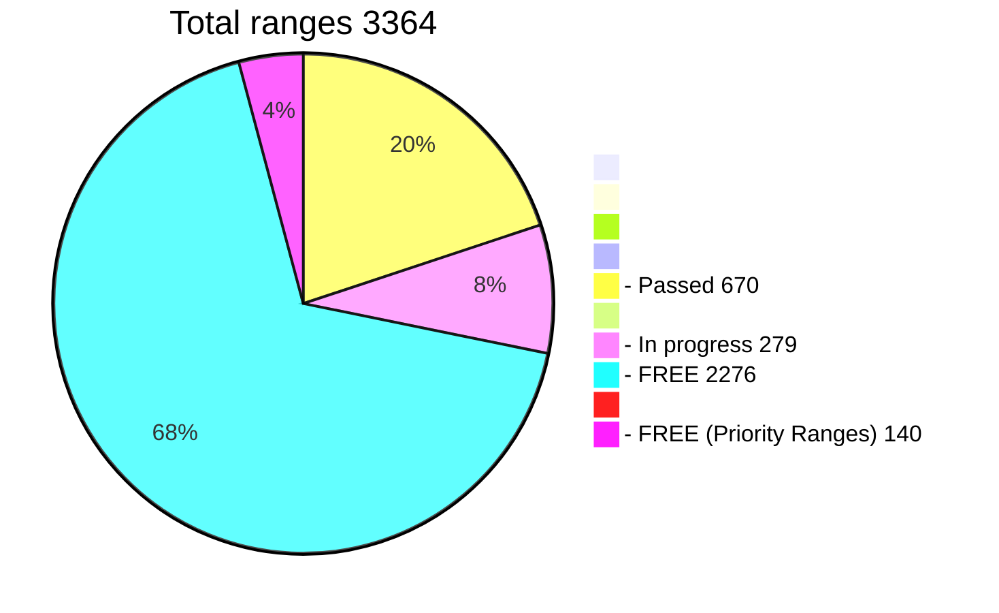

# Challenge WIF 500
 </br>
**Find the key, get 200 BTC**</br>

The known part of the key is 40 characters from 52</br>
The address [1PfNh5fRcE9JKDmicD2Rh3pexGwce1LqyU](https://www.blockchain.com/btc/address/1PfNh5fRcE9JKDmicD2Rh3pexGwce1LqyU)</br>

### Challenge is a collective search for a key
A large range of 12 characters is divided into 3364 small ranges.</br>
The program is configured correctly, it takes into account many technical aspects of searching for the initial part of the key.</br>
There is a [**table of hunters**](https://github.com/phrutis/wif500/blob/main/x64/Release/table.md) on which ranges are indicated in the process and passed.</br>
This way you won't serch empty ranges. This speeds up the overall search process.</br>
The advantage of the challenge is that if the key is found, each hunter will receive compensation for the ranges he has passed.</br>
200 btc is a worthy reward for a find key.</br>
Good luck!</br>

## How to participate in the challenge:
If you have a GPUs:</br>
**RTX 2070, 2080, 2090, 3060, 3070, 3080, 3090, A5000, A6000** and are ready to search for a key **24/7**</br>

If you do not have a 30xx card, you can [**rent**](https://vast.ai) it and participate in a collective search. </br>
For some users, [**renting**](https://vast.ai) is cheaper than searching on their own PC. There is also less noise in the house.</br>
When renting, you must take into account the risk that the key may not be found at all.</br> 
You may incur losses. Think of it not as earnings, but as a lottery.

In the [**TABLE**](https://github.com/phrutis/wif500/blob/main/x64/Release/table.md), select a **FREE** range between 0-3363

Run ```wif500-30xx.exe -range 1234``` (free range 0 - 3363)

RTX A6000 4 Gkey/s = 3 days (one range)</br>
RTX 3090 4 Gkey/s = 4 days (one range)</br>
RTX 3070 2.2 Gkey/s = 6 days (one range)</br>
RTX 2070 1,4 Gkey/s = 9 days (one range)</br>
There is a continuation of the search from the last checkpoint</br>

Add a telegram [**GPU group**](https://t.me/+WFEuFatijpowMjRi) </br>
Write: ```@phrutis``` the numbers of the range in which you took for the search.</br>
I will accept your participation and add you to the table</br>
Do not take busy (in progress) ranges, see the [**TABLE**](https://github.com/phrutis/wif500/blob/main/x64/Release/table.md).</br>
**Don't join if**
- Your gpu is below RTX 2070</br>
- You are just interested, but you are not going to participate either.</br>
- Ask questions not related to the challenge.</br>

When you have a range progress 100% take a screenshot (photo) and post it in the group. </br>
I will (check) and mark the range as passed, assign it to you.</br>

If the key is found, it will be displayed in the window and will also be written to the text file FOUND.txt</br>
Write privately in telegram ```phrutis``` that you found the key.

### Compensations:

1. When the key is found, the hunter that did find it will receive a full 200 BTC reward.</br>
2. All other hunters in the table will receive good compensation.</br>
Extra 33.64 btc will be divided by the number of ranges passed.</br>
The example will go through 1000 ranges and the key will be found.</br>
33.64 btc divided by 1000.</br>
For each range passed, the hunter will receive 0.0364 btc ($1129)</br>

## Frequently asked Questions
### Question answer:

WIF500 real?</br>
To find out, you need to go through a very large range and find out.</br>
This requires large GPU resources.<hr>

Why is the program without source codes?</br>
The correct ranges and other parameters are sewn into the WifSolverCuda program.</br>
Knowing them, the user can find the key on his own and take everything for himself.<hr>

Does the program require an internet connection?</br>
No, the program is looking for the key offline.<hr>

If I find the key can I take all the coins for myself?</br>
No, you will find the encrypted key.</br>
Only the organizers of the challenge can decrypt this key and pay you a donation.<hr>

I have a RTX 3060 TI card, and I have a low speed, how can speed up?</br>
In the new drivers for ```30xx ti```, ```20xx ti```, a limiter is installed that slows down the speed by half.</br>
You need to download the old driver from six months ago. 496.13</br>
Delete the new driver, install the old driver, the speed will increase x2</br>
After searching, you can install new drivers.<hr>

I have many GPUs. How to start?</br>
Run each GPU separately with a new range Add your card id -d ?</br>
For RTX 2070, 2080, 2090, 3060, 3070, 3080, 3090, A5000, A6000</br>
```wif500-30xx.exe -range 444 -d 0```</br>
```wif500-30xx.exe -range 445 -d 1```</br>
```wif500-30xx.exe -range 446 -d 2```</br>
```wif500-30xx.exe -range 2057 -d 3```</br>
```wif500-20xx.exe -range 888 -d 4```</br>
If you have any difficulties with the launch, you can ask in the group<hr>

Where did the diary photo come from?</br>
The man worked at the exchange office.</br> 
Through it, the miner withdrew coins. </br>
Somehow, the miner turned to the exchange office with a request to help him restore the key in the photo from the burnt diary.</br>
In 2017, there were no WIF GPU recovery programs. </br>
There were weak gpu cards at that time.</br>
It was possible to search only on the processor, but this takes thousands of years.</br>
The photo went from hand to hand.</br>
Years have passed.</br>
I was approached by a person (intermediary) who offered to find the key for 50% of the amount.</br> 
After counting the combinations, it turned out that I needed to rent 3364 RTX 3090 cards for 4 days.</br>
It is physically impossible to rent such a number of cards.</br>
The intermediary was asked to make a challenge and if the key is found, he will receive 10%. He agreed.</br>
A program was developed and the challenge was launched.<hr>

Who is the owner of the diary?</br>
This is a common question. </br>
For understanding. Bitcoin is an anonymous system. </br>
The owner is the one who has the key.<hr>

Is this theft?</br>
No.</br>
The author of the diary took the photo himself.</br> 
Thus, he made a public key out of a private key and gave it to third parties.<hr>

What happens if the key is not found?</br>
Nothing.</br>
Write on the photo SOLVED. </br>
Let's start another challenge and we'll look for it.<hr>

How to know that the key is found by someone?</br>
Verify transactions on the blockchain.<hr>

Are you looking for a compressed key, maybe it's uncompressed?</br>
The key is 99.9% compressed.</br>
Experienced programmers worked on the key.</br>
Few facts.</br>
In the photo below is an uncompressed key.</br>
All addresses after 03/30/2012 are compressed.</br>
When decoded, the known part of the key yields a compressed flag.</br>
All addresses in the blockchain transaction chain are compressed.</br>
There are many other facts indicating that the key is compressed.<hr>


Maybe you made a mistake in the handwriting and we are looking for it wrong, there is not b but 5, the third G, etc.</br>
Worked on the key:</br>
1 Forensic expert (according to suicide notes) for a fee.</br>
1 Restorer of ancient manuscripts.</br>
3 doctors (Latin medical handwriting)</br>
1 Apothecary (pharmacist) prescriptions from the doctor sometimes look much worse :-)</br>
10 literate people for whom American is their native language.</br>
Our team processed the photos, making their own expertise and experiments.</br>
On the basis of paw examinations, candidates were added before ?5....</br> 
These are the blue ranges in the table.<hr>

Bro help</br>
I have a weak card, help me, tell me the key.</br> 
I don't know how to run. Look right,</br> 
I'm running. I don't have gpu.</br> 
hahaha I went through everything, it's empty.</br> 
It's fake. I don't understand anything, but you still help me.</br>
I have a telegram full of similar messages. </br>
Questions not related to the challenge do not write to me.<hr>

phrutis why are you deleting hunters and being so demanding on screenshots?</br>
I believe that the group does not need observers (not active hunters)</br>
Why are they there to us?</br>
If a person is added, then he has read the rules. </br>
He should tell me the range number he has chosen and is looking for.</br> 
I need screenshots to know for sure that a certain range is 100% passed.<hr>

Why did you free my range? I'm still looking.</br>
Each range has a start date. </br>
If 10-12 days have passed, I check with a specific hunter about the process. </br>
If silence, the range is released. </br>
If this is the hunter's only range, it is removed.</br> 
He can return to the group later and confirm 100% completion.<hr>

I'm a miner, I have a pool of 300 gpu, my brother has 170, I have access to people with 1000 gpu.</br>
Don't treat the challenge as a paycheck. This is a lottery. </br>
So that you don't take too many risks. </br>
You can participate with only a small part of your gpu cards</br>
For example 50, 100 cards, leave the rest in mining.<hr>

How can I rent gpu cards? I do not know how to do that.</br>
Ask for help in the group, they will help you, prompt. </br>
Unfortunately there are no instructions yet.<hr>

I will search at the end when there are few ranges left. So my chances will be higher :-)</br>
This is not logical, the key can be found earlier, or in the middle of the path.</br> 
Your odds calculations will be broken.<hr>

What are the best ranges to look for? Where are the chances?</br>
In blue, (while they are still there) because they are candidates.</br>
And so everywhere the chance is the same.<hr>

Why are some passed ranges without green check marks?</br>
The hunter passed more than 90%, but for some reason did not have time (could not) take a screenshot of 100%. </br>
There were cases when they launched from bat files, after 100% the console window closed automatically.</br>
This range is assigned to him for compensation.</br>
When there are very few ranges left, it will become free again.</br>
If another hunter passes it, then he will become its owner.</br>
Now the program has a continuation of the search from the last checkpoint.<hr>

I'm worried that someone is faking a sequel from the end.</br>
Do not worry, there is a very powerful protection.</br>
Fake hex is impossible<hr>

Why didn't you post the original diary photo? Why did you change the letters of the key?

Do you want me to post part of the real key?</br>
Why then the challenge?</br>
Can it be closed?</br>

If I post the correct part of the key. The key can be quickly found by the miner, he will take all the coins for himself.</br>
Hunters who participate in the challenge will not receive a prize and compensation, they will suffer losses. </br>
The mediator and the organizers of the challenge will be left without coins.</br>
You understand that this is not logical.<hr>

Why did you remove me from the group?</br>
If the hunter was added to the group and did not report the range number within 24 hours.</br>
He will be removed, only hunters are needed in the group.</br>
You can join the group again when you're ready to search.<hr>

I often turn off the light, how to continue? </br>
Run 1234_1Continue.bat continuation files.</br>
The continuation will start from the last checkpoint.</br>
IMPORTANT!!!</br>
Windows may have enabled disk write caching before writing to a file. </br>
In this case, after a power outage, the files may be EMPTY.</br>
You need to disable this feature. </br>
Instruction [EN](https://docs.microsoft.com/en-us/troubleshoot/windows-server/backup-and-storage/turn-disk-write-caching-on-off) and [RU](https://techarks.ru/general/osobennosti/vklyuchit-otklyuchit-keshirovanie-zapisi-na-disk-v-windows-10-8-7/) <hr>

